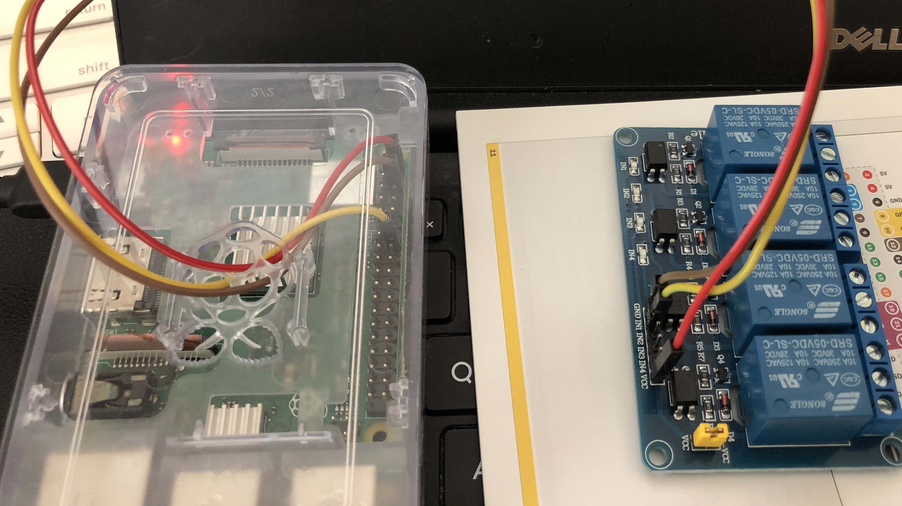
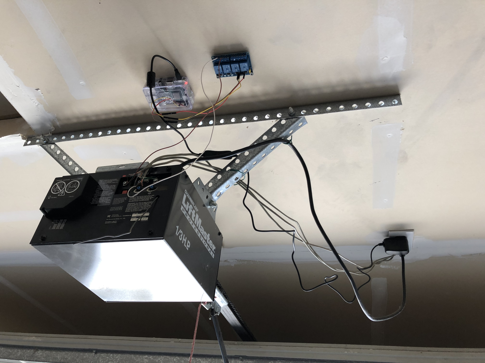

# garagedoorgadget

## Create new AVS Gadget device  
Follow https://github.com/alexa/Alexa-Gadgets-Raspberry-Pi-Samples/blob/master/README.md#registering-a-gadget-in-the-alexa-voice-service-developer-console  
**Amazon ID** and **Alexa Gadget Secret** is required for next step

## Install Alexa Gadget Toolkit on Raspberry Pi  
Follow  
https://github.com/alexa/Alexa-Gadgets-Raspberry-Pi-Samples/blob/master/README.md#installation

## Create your own Gadget applicaiton on Raspberry Pi  
[ini file](./garage_door.ini) add your own Gadget product **Amazon ID** and **Alexa Gadget Secret**   
[python app](./garage_door.py)

## Create Alexa custom skillset
https://developer.amazon.com/alexa/console/ask

## Write intent handler
https://github.com/mcparade/garagedoorgadget/blob/main/skill/lambda/index.js

## Wire Raspberry Pi and relay switch

## Test
https://drive.google.com/file/d/1j-BqbwyUGvaKqjtk3CFHmaSWrYcE524b/view?usp=sharing

## Wire relay switch and garage door

## Final test
https://drive.google.com/file/d/1L59wsgpv6dyUGH911viy9P9oJVXtIJXx/view?usp=sharing
