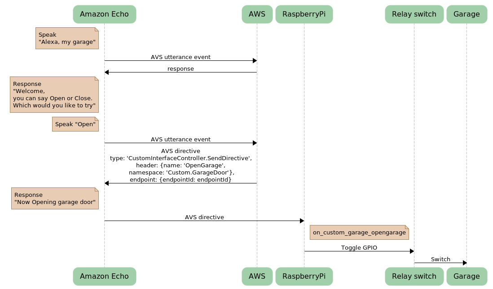

# Garage Door Gadget
## Overall flow

## Create new AVS Gadget device profile on AWS  
Follow https://github.com/alexa/Alexa-Gadgets-Raspberry-Pi-Samples/blob/master/README.md#registering-a-gadget-in-the-alexa-voice-service-developer-console  
**Amazon ID** and **Alexa Gadget Secret** is required for next step

## Install Alexa Gadget Toolkit on Raspberry Pi
Alexa Gadget Toolkit can be downloaded from gitHub.
Follow  instructions in this link.
https://github.com/alexa/Alexa-Gadgets-Raspberry-Pi-Samples/blob/master/README.md#installation

## Create your own Gadget application on Raspberry Pi  
Once Alexa Gadget Tookit is installed completed, modify configuration with your own secret key.
[ini file](./garage_door.ini) add your own Gadget product **Amazon ID** and **Alexa Gadget Secret**   
[python app](./garage_door.py)

## Running your application.
python3 /home/pi/Alexa-Gadgets-Raspberry-Pi-Samples/launch.py --example "your example name" --pair

## Running Alexa Gadget Toolkit on boot
 - Edit file /etc/rc.local
 - Add this line
 - python3 /home/pi/Alexa-Gadgets-Raspberry-Pi-Samples/launch.py --example "your example name" --pair

## Create Alexa custom skillset
https://developer.amazon.com/alexa/console/ask

## Write intent handler
https://github.com/mcparade/garagedoorgadget/blob/main/skill/lambda/index.js

## Wire Raspberry Pi and relay switch

## Wire relay switch and garage door
Connect NC and Common to connector to push button

## Hooray!! 

